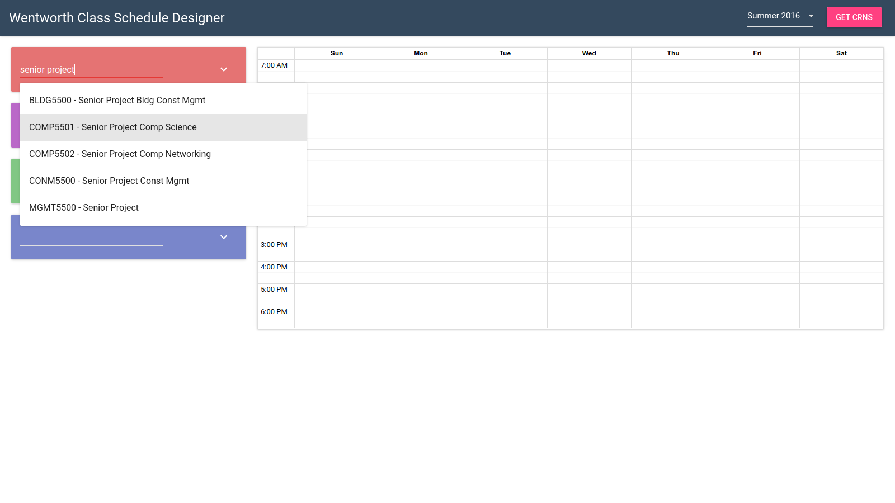
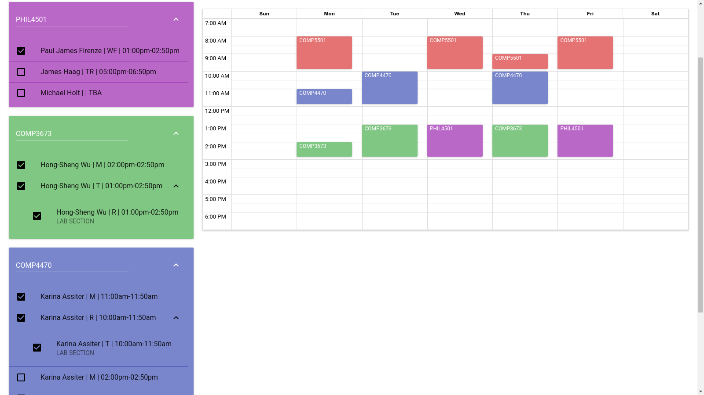

# Wentworth Class Schedule Designer
## Screenshots
Searching for classes

Calendar with classes selected

## Design

I decided to use a simple mobile-friendly implementation of Google’s Material Design to create the easiest user-friendly web application possible. Using the Material-UI React library, I was able to achieve this. With elegant design principles, everything right in front of you, I believe this application is simple enough for anyone to create a class schedule with.

## How To Use

When first loading the app, you are presented with a very simple semester selection screen, specifically designed not to selected the newest semester.

Upon selecting your desired semester, you are given 4 text boxes and a calendar component. Simply begin searching for your course. Once you have one chosen, you will see all the available options: professors, times, rooms, and what not. There, you can begin checking off which class you would like to take. As you select a class, you will see the calendar update with your choices to see your week at a glance in a much more organized way.

## Export Feature
Say you’ve just made your best class schedule yet: no 8AMs, that professor you like, some friends with you, but now you need to put it someplace convenient. Luckily for you, there is an **export feature**! You can export your genius schedule to an ICS calendar file, compatible with just about all calendar applications.

## Where does this data come from?
Funny you ask, there's actually a web scraper component to this project.
Since Wentworth won't give me access to their class database, I'm left with getting it myself.
Not a big deal, I've already solved this problem!
You can check out the web scraper project here: [Wentworth Class Scraper](example.com)

# TODO
WHEN CHANGING SEMESTERS CONTENT IS NOT RESET
